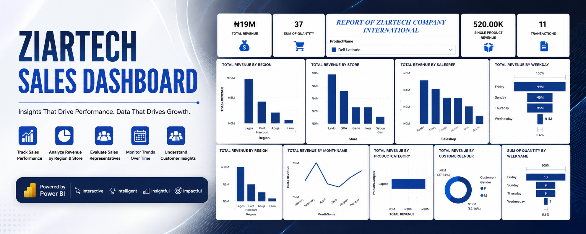

# 📊 Ziartech Sales Dashboard



> An interactive Power BI Sales Analytics Dashboard that provides comprehensive insights into revenue, sales performance, customer behavior, and business trends, empowering data-driven decision-making.

## 📖 Project Overview

The Ziartech Sales Dashboard was developed to transform raw sales data into meaningful business insights. It provides a centralized view of revenue performance across regions, stores, sales representatives, product categories, and customer demographics, enabling stakeholders to monitor KPIs and identify growth opportunities.

## 🎯 Business Objectives

- Monitor overall sales performance.
- Track total revenue and sales quantity.
- Compare revenue across regions and stores.
- Evaluate sales representative performance.
- Analyze product category performance.
- Understand customer demographics.
- Monitor monthly and weekday sales trends.
- Support strategic business decisions with real-time insights.

## 🛠️ Tools & Technologies

- Microsoft Power BI
- Power Query
- DAX (Data Analysis Expressions)
- Microsoft Excel

## 📈 Dashboard Features

### KPI Cards

- Total Revenue
- Total Quantity Sold
- Number of Transactions
- Highest Single Product Revenue

### Sales Analysis

- Revenue by Region
- Revenue by Store
- Revenue by Sales Representative
- Revenue by Product Category

### Customer Analysis

- Revenue by Customer Gender

### Time Analysis

- Revenue by Month
- Revenue by Weekday
- Quantity Sold by Weekday

### Interactive Features

- Product Name Slicer
- Dynamic Filtering
- Interactive Cross-filtering
- Drill-down Analysis

## 💡 Key Insights

- Generated over **₦19 Million** in total revenue.
- Processed **37** product sales across **11** transactions.
- **Lagos** recorded the highest regional revenue.
- **Lekki** emerged as the best-performing store.
- **Friday** generated the highest sales revenue.
- **Laptop** was the highest revenue-generating product category.
- Male customers contributed approximately **62%** of total revenue.

## 🚀 Business Impact

This dashboard enables organizations to:

- Monitor business performance in real time.
- Identify high-performing regions and stores.
- Measure sales representative productivity.
- Analyze customer purchasing behavior.
- Improve inventory planning.
- Support strategic sales planning.
- Make faster, data-driven decisions.

## 📂 Dataset

The dataset contains transactional sales records including:

- Revenue
- Quantity Sold
- Product Name
- Product Category
- Region
- Store
- Sales Representative
- Customer Gender
- Sales Date

## 📐 DAX Measures

Key DAX calculations include:

- Total Revenue
- Total Quantity
- Transaction Count
- Revenue by Region
- Revenue by Store
- Revenue by Sales Representative
- Revenue by Product Category
- Monthly Revenue
- Weekday Revenue


## 🖼️ Dashboard Preview

### Sales Dashboard


## 📁 Repository Structure

```text
ziartech-sales-dashboard/
│
├── README.md
├── Ziartech_Sales_Dashboard.pbix
├── dataset.xlsx
├── Ziartech-sales-banner.png
├── Sales Dashboard.png
└── docs/
    └── Project_Report.pdf
```


## 💼 Skills Demonstrated

- Data Cleaning
- Data Modeling
- Data Analysis
- Data Visualization
- DAX
- Power Query
- KPI Development
- Dashboard Design
- Business Intelligence
- Sales Analytics
- Trend Analysis

## 👨‍💻 Author

**Abdullahi Muhammed Soliu**

**Data Analyst | Power BI | SQL | Excel | Business Intelligence | Dashboard Developer**

Passionate about transforming raw data into meaningful insights that support strategic business decisions.

### ⭐ If you found this project useful, consider starring the repository and connecting with me on LinkedIn.
